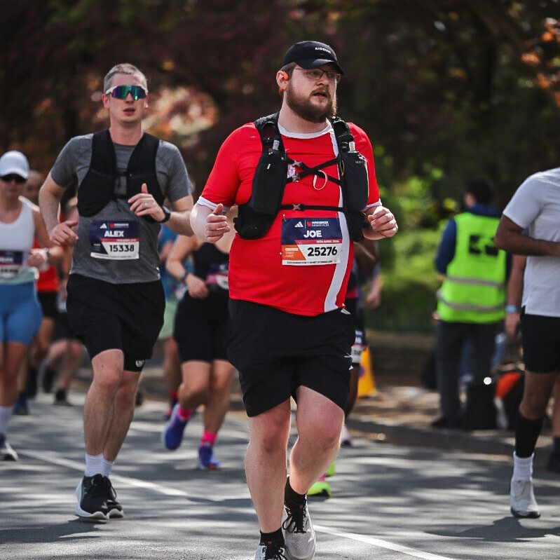

# Who am I?

## Joe Wilson

### Senior Data Scientist | NHS England Data Science and Applied AI Team

---

{ width="100%" }

{ width="100%" }

---

### :material-briefcase: At Work

* Background in Aerospace Engineering and Data Science
* Code mainly in Python, but also R and SQL (and LabVIEW from engineering days!)
* Working in the Reproducible Analytical Pipelines (RAP) space for four years at NHS England
* Currently working on:
    * Predicting Length of Stay in Hospital
    * Automating metric production in FDP
* NHS R Fellow and sit on the [NHS Open Analytics](https://www.linkedin.com/company/nhs-open-analytics-community) Committee
* Tech Lead for Gold RAP Delivery
* Mission: To make high-standard, best-practice pipelines the easy, default behaviour for everyone

### :material-home-heart: At Home

* Live in Leeds with my wife
* Love getting outside — running and hiking! :material-run:
    * Ran the Manchester Marathon two weeks ago
    * Heading off to the Lake District for four days of hiking :material-terrain:
* General nerd with a large board game collection :material-cards-playing:
    * Current favourite: **Skyjo**

---

## :material-web: Find Me Online

* :fontawesome-brands-github: **GitHub**

    ---

    [@josephwilson8-nhs](https://github.com/josephwilson8-nhs)

* :fontawesome-brands-linkedin: **LinkedIn**

    ---

    [Joseph Wilson](https://www.linkedin.com/in/jrdwilson/)

* :material-email: **Email**

    ---

    [joseph.wilson8@nhs.net](mailto:joseph.wilson8@nhs.net)

* :fontawesome-brands-microsoft: **Teams**

    ---

    [Chat with me on Teams](https://teams.microsoft.com/l/chat/0/0?users=joseph.wilson8@nhs.net)

